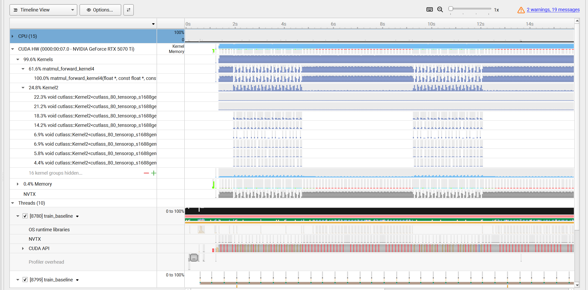

# llm训练优化实验

# 项目背景：

项目基于Andrej Karpathy 的 llm.c 进行的 GPT-2 训练优化项目，希望能通过优化加速GPT-2的训练速度。

# 配置

（**×**）项目通过在auto DL平台，租借云端实例，配置是RTX 3080 Ti(12GB)。由于是docker容器，无法使用ncu这类监测工具。

（✔）通过vast.ai，租借VM虚拟机，可以实现ncu安装和监测，配置是RTX 5070 Ti，之后步骤大致都相同

# 参数

GPU: NVIDIA GeForce RTX 5070 Ti
**SM count: 70**
Max threads per SM: 1536
**Max warps per SM: 48**
**Registers per SM: 65536**
Registers per block: 65536
**Shared mem per SM: 102400 bytes**
Shared mem per block: 49152 bytes

# 流程

## 环境配置和baseline下载

Andrej Karpathy原项目的链接为：https://github.com/karpathy/llm.c.git（建议使用学术加速，否则会很慢）

## 云端实例的连接

直接在自己电脑终端输入提供的ssh连接，然后输入密码即可连接

## 调试工具下载

调试工具主要会使用到nsight system 和nsight compute

```jsx
apt-get install -y nsight-systems-cli 
```

```jsx
apt-get update && apt-get install -y nsight-compute
```

# Baseline 结果

- total average iteration time: 142.702125 ms
- throughput：28680 token/s 。

## Baseline Nsight system 结果



现象以及总结原因：

- matmul_forward_kernel4占据61.6%的GPU time，是最大的bottleneck
- matmul的调用非常碎片化
    
    > `matmul_forward_kernel4`的调用非常频繁且间隔不均匀，这是因为GPT-2每个layer里有4次matmul（QKV projection、attention projection、FFN up、FFN down），12个layer就是48次调用，每次矩阵形状还不一样（比如`[4096, 768]`和`[4096, 3072]`），导致每次launch的grid size都不同，执行时间参差不齐
    > 
- 第二大的GPU time占用是Kernel2，其中有很多cutlass的调用
    
    > 在llm.c项目中，karpathy在线性层中使用手写的CUDA kernel，但是在baseline的attention部分使用了`cublasSgemmStridedBatched`
    > 
    > 
    > ```jsx
    > cublasCheck(cublasSgemmStridedBatched(cublas_handle, CUBLAS_OP_T, CUBLAS_OP_N, T, T, HS, &alpha, k, HS, T * HS, q, HS, T * HS, &beta, preatt, T, T * T, B * NH));
    > ```
    > 
    > 由于批量矩阵乘法手写较为复杂，所以karpathy通过cuBLAS调用实现注意力层的Batched GEMM计算
    > 

## Baseline ncu 结果


- Compute 51% 和 Memory 52% 都不高，这个kernel是compute-bound还是memory-bound？还是说有第三种可能？
    - roofline
    
    
    
    - **"Latency Issue"** — compute throughput and memory bandwidth both below 60%, typically indicate **latency issues 所以可能是latency issue**
- NCU底部给了三个优化建议：哪个是根因，哪个是症状？它们之间有没有因果关系？
    
    128 registers/thread
    ↓
    Occupancy 33.3%（每个SM只有4个active warp，上限12个）
    ↓
    没有足够的warp来hide latency
    ↓
    L1TEX访问模式差（uncoalesced）的延迟无法被掩盖
    ↓
    Stall Short/Long Scoreboard爆发
    
    所以根本原因是register数量
    
    
    
- **Warp State解读**
    - **Stall Not Selected（最大）**：warp已经ready但scheduler没选它——这直接说明active warp数量不足，scheduler无事可做，occupancy太低的直接证据。
    - **Stall Short Scoreboard（第二大）**：等shared memory或L1的返回结果——说明shared memory访问有延迟，可能有bank conflict。
    - **Stall Long Scoreboard（第三）**：等global memory——DRAM延迟没被隐藏，因为warp数量不够。

## 第一个优化目标

综上，第一个优化目标是降低register的使用量，提升occupancy

## 回看代码 matmul_forward_kernel4

1. 从哪里可以体现出register
    
    ```jsx
    float vals[8][8]    // 8×8 = 64个float = 64个寄存器
    float4 rhs[8]       // 每个float4有4个float，8个 = 32个寄存器
    float4 lhs          // 4个寄存器（循环内，但编译器要保留）
    // 加上各种索引变量 oc, si, si_start等
    // 总计约 64+32+其他 ≈ 100个+
    ```
    
2. 已经有`__launch_bounds__(256, 2)`了——256线程/block，每SM最少2个block。但NCU还是报occupancy 33.3%，说明什么？
    1. `(256, 2)`的意思是：每个block最多256线程，每个SM至少驻留2个block
3. 总shared memory用量，3080 Ti每个SM有多少KB shared memory？这会不会限制occupancy？
    
    ```jsx
    __shared__ float lhs_s[128][32];  // 128×32×4 bytes = 16,384 bytes = 16 KB
    __shared__ float rhs_s[128][32];  // 同上 = 16 KB
    // 合计 = 32 KB per block
    ```
    
    所以一个block就用掉了32KB，每个SM最多只能放`100/32 ≈ 3`个block——但register限制已经把occupancy压到33.3%（4个warp/scheduler = 2个block），shared memory反而不是瓶颈。
    

128 registers/thread × 256 threads/block = 32768 registers/block
RTX 3080 Ti每个SM: 65536个寄存器
65536 / 32768 = 2个block/SM
2 × 256 / 32 = 16个warp/SM
硬件最大: 48个warp/SM
Occupancy = 16/48 = 33.3% ✓

## 问题总结

`vals[8][8]`这个8×8的累加器数组是register压力的核心，它必须存在寄存器里（否则每次访问都要去L1，更慢），这是tile-based matmul的基本设计。

**这意味着在这个kernel架构下，register压力是无法根本解决的。**

这就是为什么真正的解法不是调参，而是**换架构**——用cuBLAS/cuBLASLt，它内部用的是Tensor Core + 完全不同的数据流设计，绕开了这个限制。

# V2改进方向1-在此kernel上做优化

将`float vals[8][8]` → `float vals[4][8]` 

registers = 96（32一组）

96 registers/thread × 256 threads/block = 24576 registers/block
RTX 3080 Ti每个SM: 65536个寄存器
65536 / 24576 = 2 .6 = 2个block/SM
2 × 256 / 32 = 16个warp/SM
硬件最大: 48个warp/SM
Occupancy = 16/48 = 33.3% 没有优化

### 要让SM能放3个block，需要

65,536 / 3 = 21,845 registers/block
21,845 / 256 = 85.3 registers/thread
→ 需要≤85个寄存器/thread
→ 编译器对齐到64
→ 意味着vals数组最多 64 - 32(rhs) - 10(其他) = 22个float
→ 大约vals[2][8]或vals[4][4]

### 对比

之前的设计：

- 每个线程处理 `8×8` 输出
- block是 `16×16` 个线程
- 所以每个block处理 `(16×8) × (16×8)` = `128×128` 的输出

改成`vals[4][4]`之后：

- 每个线程处理 `4×4` 输出
- block还是 `16×16` 线程
- 每个block处理 `(16×4) × (16×4)` = `64×64` 的输出

### 代价

需要的block数量 = 总输出大小 / 每个block的输出
block数量变成原来的 (128×128)/(64×64) = 4倍
block数量多了，**kernel launch overhead增加，grid调度压力增加**。

**更重要的是：每个线程从global memory里加载的数据复用率降低了**。tile越大，每个数据被复用的次数越多，带宽效率越高。

# v2的测试结果

- total average iteration time: 113.273080 ms
- throughput: 36287token/s

**比baseline的143ms快了，throughput提升了约21%。**

### 指标对比

| **指标** | **Baseline (8x8)** | **V2 (4x4)** | **变化趋势** |
| --- | --- | --- | --- |
| **执行时间 (Time)** | 143 ms | **113 ms** | **提升~21%** |
| **寄存器 (Registers)** | 128 | 108 | 减少 20 个 |
| **占用率 (Occupancy)** | 33.3% | 33.3% | 持平 |
| **计算吞吐量 (Compute)** | 51% | 28% | 大幅下降 |
| **显存吞吐量 (Memory)** | 52% | 59% | 小幅提升 |
| **主要停顿 (Main Stall)** | Not Selected | **Long Scoreboard** | 瓶颈转移 |
| **duration sum time** | 2037us | 723us | 降低 |

### 为什么瓶颈从Not selected 转移成 Long scoreboard

**！数据复用！**

Baseline: 每次global memory load支撑8次计算
V2:       每次global memory load只支撑4次计算
→ global memory访问频率相对翻倍
→ Long Scoreboard stall增加

## v2总结

每个kernel的实例比之前baseline快了3倍，即使kernel launch次数多了四倍，但是总时间还是更少

- 大tile → 高数据复用 → compute efficient → 但register多 → occupancy低 → latency hiding差
- 小tile → 低数据复用 → memory访问多 → 但每个kernel快 → 总时间可能更短

# v3优化目标—bank conflict

**问题1：**L1TEX Global Store/Load Access Pattern ( stride access）
Est. Speedup: 29.40%

> The memory access pattern for global stores to L1TEX might not be optimal. On average, only **16.0 of the 32 byte**s transmitted per sector are utilized by each thread. This could possibly be caused by a **stride** between threads.
> 

利用率 = 16/32 = 50%
每次传输32字节，但只有16字节是你真正需要的，**另外16字节是浪费的带宽**。

**问题2：**Shared Store Bank Conflicts（好改一点）
Est. Speedup: 8.39%

```jsx
// 原来
__shared__ float lhs_s[128][32];
__shared__ float rhs_s[128][32];

// 加一列padding
__shared__ float lhs_s[128][36];
__shared__ float rhs_s[128][36];
```

原理：加了一列padding后，原本落在同一bank的元素被错开了一个位置，bank conflict消失。

# v3结果

bank conflict反而还增加了，从4.6way 变成4.7way

**原因：** padding改成36列之后，虽然地址对齐了，但36不是解决bank conflict的正确padding值。

### 总结

这个其实不是主要矛盾，主要矛盾还是occupancy=33.3%

# v4优化目标—降低108register

**当前v2（108 registers）：**

`108 × 256 threads = 27,648 registers/block
65,536 / 27,648 = 2.37 → 2个block/SM
2 × 256 / 32 = 16 warps/SM
16 / 48 = 33.3% ✓`

**要达到3个block/SM需要：**

`65,536 / 3 = 21,845 registers/block
21,845 / 256 = 85.3 registers/thread
→ 需要≤85个register`

**要达到4个block/SM需要：**

`65,536 / 4 = 16,384 registers/block  
16,384 / 256 = 64 registers/thread
→ 需要≤64个register`

### 但还有一个限制！！！

`Shared mem per SM: 102,400 bytes
v2每个block用: 32,768 bytes = 32KB`

`102,400 / 32,768 = 3.125 → 最多3个block/SM（shared memory限制）`

所以即使register降到85以下，**shared memory也把上限卡在3个block**，occupancy最多能到：

`3 × 256 / 32 / 48 = 50%`

# V4测试结果

- total average iteration time: 108.287516 ms
- throughput: 37287token/s

| 版本 | 改动 | 时间 | 提升 |
| --- | --- | --- | --- |
| Baseline | 原始8×8 tile, 128 reg | 143ms | - |
| V2 | 4×4 tile, 108 reg | 113ms | +21% |
| V3 | V2 + padding | 112ms | 微小 |
| V4 | V2 + launch_bounds(3) | 108ms | +4% |

### 对比Baseline vs V4

| 指标 | Baseline | V4 | 变化 |
| --- | --- | --- | --- |
| Registers | 128 | 80 | -37.5% |
| Occupancy | 33.3% | 50% | +50% |
| Duration | 776us | 227us | -70.7% |
| Compute Throughput | 51% | 35% | 下降 |
| Memory Throughput | 52% | 70% | 上升 |

# v5优化目标—减少global memory访问次数。

Warp State里**Long Scoreboard依然是最大的stall（48.5%的cycles）**，说明：

> occupancy提升了，但global memory延迟还是没被充分隐藏。
> 

具体手段是**prefetching**——在计算当前tile的同时，提前把下一个tile从global memory加载到寄存器，用计算来掩盖内存延迟

### 现在的问题在哪里

执行时间线是这样的：

`时间轴 →
[搬运so=0块] [等sync] [计算so=0块] [搬运so=32块] [等sync] [计算so=32块] ...
     ↑                                   ↑
  global memory延迟（慢）            global memory延迟（慢）
  warp在等数据                        warp在等数据`

这就是Long Scoreboard stall的来源

### Prefetching的思路

如果能改成这样：

`时间轴 →
[搬运so=0块] [计算so=0块] [计算so=0块] ...
             [搬运so=32块]                 [计算so=32块] ...
                          [搬运so=64块]                    [计算so=64块]`

## 方法

需要用`cp.async`异步拷贝指令，改变sync逻辑，维护两套buffer。

**方案对比：双 Buffer 还是 cp.async 单 Buffer？**

| **维度** | **方案 A：双 Buffer (128 → 64)** | **方案 B：cp.async + 单 Buffer (128)** |
| --- | --- | --- |
| **Smem 占用** | **32KB** (极低，能换取高 Occupancy) | **32KB** (刚好腾出空间) |
| **代码复杂度** | **极高**（Grid/Block/Tile 全部要重算） | **中等**（逻辑结构不变，只换加载指令） |
| **延迟隐藏** | **完美**（计算当前 Tile 时预取下一块） | **部分**（利用异步指令减少寄存器压力） |
| **推荐点** | 追求极限 Occupancy | **追求最快开发效率 + 解决 48KB 限制** |

# V5结果（**cp.async + 单 Buffer (128)）**

total average iteration time: 107.637439 ms


**主要Stall从Long Scoreboard变成了MIO Throttle**
这说明cp.async确实起作用了——global memory等待（Long Scoreboard）减少了，但出现了新瓶颈：**MIO Throttle**。

MIO Throttle：

> "each warp spends 12.1 cycles stalled waiting for the MIO (memory input/output) instruction queue to be not full"
> 

意思是MIO指令队列满了，warp在排队等。

**cp.async本身就是MIO指令**，我们用cp.async替换了普通load，减少了Long Scoreboard，但cp.async指令本身把MIO队列打满了。

### 完整对比表（不包含v3）

| 版本 | 改动 | 时间 | 主要Stall |
| --- | --- | --- | --- |
| Baseline | 8×8, 128reg | 143ms | Not Selected |
| V2 | 4×4, 108reg | 113ms | Long Scoreboard |
| V4 | +launch_bounds(3), 80reg | 108ms | Long Scoreboard |
| V5 | +cp.async | 107ms | **MIO Throttle** |

### 完整总结表

| 版本 | 时间 | Occupancy | Compute | 主要Stall | 用了Tensor Core |
| --- | --- | --- | --- | --- | --- |
| Baseline | 143ms | 33.3% | 51% | Not Selected | ❌ |
| V2 | 113ms | 33.3% | 28% | Long Scoreboard | ❌ |
| V4 | 108ms | 50% | 35% | Long Scoreboard | ❌ |
| V5 | 107ms | 50% | 37% | MIO Throttle | ❌ |
| cuBLASLt | 118ms | 8.33% | 83% | Math Pipe Throttle | ✅ |

# 优化方向换计算架构用cuBlasLt

通过cuBlasLt可以启用tensor core


手写kernel:   FMA指令 → 标量浮点 → Tensor Core利用率 0%
cuBLASLt:    MMA指令 → 矩阵运算 → Tensor Core利用率 63-83%


# cuBLasLt分析

1. **Math Pipe Throttle（45%的cycles）**
    
    Tensor Core已经被打满了，warp在排队等Tensor Core空出来。这说明**计算密度已经到达硬件上限**，这个瓶颈基本无法靠代码优化解决，只能换更快的GPU或者用更高效的数据类型。
    
2. **Wait Stalls（36.8%的cycles）**
    
    warp在等固定延迟的指令完成，比如MMA指令本身有固定的pipeline latency。NCU建议增加active warps来hide这个延迟——但occupancy已经被shared memory卡在8.33%，很难再提升。
    
3. **Uncoalesced Shared Accesses（20%的wavefronts有问题）**
    
    这是唯一还有代码级优化空间的地方。CUTLASS kernel内部的shared memory访问有bank conflict，导致20%的shared memory事务是多余的。
    

### 整个实验的完整结论链

| 版本 | 时间 | Occupancy | Tensor Core | 主要瓶颈 |
| --- | --- | --- | --- | --- |
| Baseline | 138ms | 33.3% | 0% | Not Selected（warp不够） |
| V2-V5手写优化 | 107ms | 50% | 0% | MIO Throttle（内存队列满） |
| cuBLASLt | 114ms | 8.33% | 63-83% | Math Pipe Throttle（算力打满） |

# bf16_cublast优化—混合精度

# bf16_cublast结果

total average iteration time: 137.150939 ms

原因是：**数据还是FP32，但让cuBLAS用BF16 Tensor Core做中间计算，需要在FP32和BF16之间来回转换，反而增加了开销。**

# GPU训练优化深化实验报告 — RTX 5070 Ti

> 在原有项目基础上，我在 RTX 5070 Ti（Blackwell架构，sm_120）上重新设计并执行了一套更系统的性能优化实验，目标是通过NCU硬件指标驱动每一步优化决策，而不是凭经验猜测。
> 

---

**第一步：Baseline建立与根因分析**

> 首先在5070 Ti上复现了baseline，吞吐量约22,800 tok/s，训练单步耗时138ms。用Nsight Systems确认matmul_forward_kernel4占据61%的GPU时间；用Nsight Compute深挖，得到三个关键指标：
> 
> - Theoretical Occupancy：33.3%
> - 主要Warp Stall：Stall Not Selected（最大）
> - Compute / Memory Throughput：均约50%，NCU标注为Latency Issue
> 
> 根因定位过程：Stall Not Selected说明warp已经ready但scheduler没有可选的eligible warp，直接指向warp数量不足。通过数学验证：128 registers/thread × 256 threads/block = 32,768 registers/block，65,536 / 32,768 = 2个block/SM，occupancy = 16/48 = 33.3%，与NCU完全吻合。根因是`vals[8][8]`累加器数组（64个float）和`float4 rhs[8]`（32个float）导致的register压力，这是tile-based matmul的固有设计，无法通过简单调参解决。
> 

---

**第二步：手写Kernel的迭代优化**

> 我做了四个版本的代码级优化，每次用NCU验证硬件指标变化：
> 
> 
> **V2：缩小tile从8×8到4×4**
> vals数组从64个float缩到16个，register从128降到108。occupancy没有突破（108×256/65536向下取整仍为2个block），但每个block工作量减少为原来的1/4，单次kernel时间从776us降到262us，总时间113ms。主要stall从Not Selected变成Long Scoreboard，说明warp数量不再是最大瓶颈，global memory延迟被暴露出来。
> 
> **V4：`__launch_bounds__(256, 3)`**
> 告诉编译器每SM至少放3个block，编译器将register从108压到80，产生少量spill（12字节）。重新计算：80×256=20,480，65,536/20,480=3.2→3个block/SM，occupancy从33.3%突破到50%。吞吐时间降到108ms。但值得注意的是，NCU的Scheduler Statistics显示Eligible Warps Per Scheduler反而从baseline的1.41降到了0.5——occupancy提升了，但warp ready的比例下降了，说明occupancy数字本身不等于调度效率。
> 
> **V5：cp.async单buffer**
> 用异步拷贝指令替换普通load，将global memory搬运从寄存器路径改为直接写shared memory，绕开了load指令的寄存器占用。Long Scoreboard明显减少，但主要stall变成了MIO Throttle（49.8% cycles）——cp.async本身是MIO指令，大量发射导致MIO队列成为新瓶颈。时间小幅降到107ms。
> 
> 手写优化的天花板：Tensor (FP) pipe利用率全程为0%，FMA约15%。五个版本累计提升约25%，但始终没有用上Tensor Core。
> 

---

**第三步：cuBLASLt对比与根本差距**

> 编译cuBLASLt版本，总时间114ms，比手写v5慢7ms。但NCU揭示了两者之间本质上的差距：
> 
> 
> 用Compute Workload Analysis对比，手写kernel的Tensor (FP) pipe利用率为0%；cuBLASLt的Tensor (FP) pipe利用率达到63%，SM Busy 83.8%，NCU标注"Very High Utilization"。
> 
> 根本差距在指令层面：手写kernel用标量FMA，每条指令1次浮点运算；cuBLASLt用MMA指令，一条`mma.sync`处理16×16×8=2048次运算，计算密度差了几百倍。这解释了为什么cuBLASLt即使occupancy只有8.33%（224个寄存器/线程，shared memory把每SM block数卡到1），compute throughput仍然达到83%——Tensor Core不需要高occupancy来hide latency，靠计算密度本身就打满了Math Pipe。
> 
> cuBLASLt在5070 Ti上比手写版本慢的原因：cuBLASLt的heuristic算法是为其他架构调优的，在Blackwell（sm_120）这张新卡上选择的算法不是最优的。这也说明库并不总是最优，在新架构上需要重新调优。
> 

---

**当前瓶颈与下一步方向**

> cuBLASLt的NCU显示主要瓶颈是Math Pipe Throttle（45% cycles）——TF32 Tensor Core已接近硬件算力上限。真正的下一步优化有两个方向：
> 
> 
> 第一，换BF16精度：数据和计算都用BF16，BF16 Tensor Core峰值算力是TF32的2倍，理论上还有2×提升空间。尝试了仅修改compute type为CUBLAS_COMPUTE_32F_FAST_16BF的混合精度方案，但因为数据仍是FP32存储需要来回转换，反而变慢（114ms→137ms），说明真正的BF16优化需要整个模型数据流的重构。
> 
> 第二，Flash Attention：当前attention实现需要将T×T的preatt矩阵（T=1024时约200MB）写到DRAM再读回来做softmax。Flash Attention通过分块在SRAM里完成softmax，DRAM流量从O(T²)降到O(T)，是attention部分最重要的优化。
> 

---

**核心结论**

| 版本 | 时间 | Occupancy | Tensor Core利用率 | 主要Stall |
| --- | --- | --- | --- | --- |
| Baseline | 138ms | 33.3% | 0% | Not Selected |
| V2 4×4 tile | 113ms | 33.3% | 0% | Long Scoreboard |
| V4 +launch_bounds | 108ms | 50% | 0% | Long Scoreboard |
| V5 +cp.async | 107ms | 50% | 0% | MIO Throttle |
| cuBLASLt | 114ms | 8.33% | 63% | Math Pipe Throttle |

> 这个实验最核心的insight是：性能优化是一个不断发现新瓶颈的过程，每解决一个瓶颈，下一个就会浮现。手写优化的真正天花板不是occupancy，而是指令集——不用Tensor Core，无论怎么调occupancy和内存访问，都有FMA算力的硬上限。cuBLASLt通过MMA指令从根本上换了计算路径，这才是1.21×加速的来源。
>